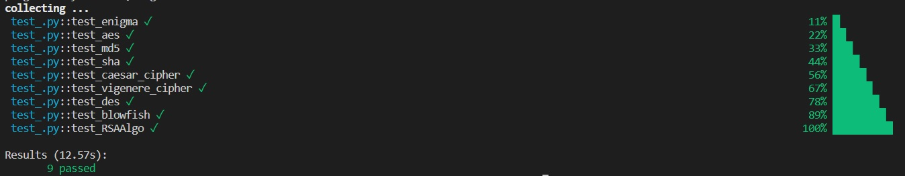

<h1>Brief 25 - CryptoApp-master</h1>

<h2>Tests automatisés avec GitLab et GitHub</h2>
<p>GitLab et GitHub sont des plates-formes d'hébergement de projets de développement logiciel, qui permettent aux développeurs de collaborer sur des projets de manière centralisée ou décentralisée en utilisant Git, un système de contrôle de version distribué. L'une des fonctionnalités clés de ces plates-formes est la possibilité de gérer des tests automatisés dans le cadre de la construction et de la validation du code source.</p>

<p>GitLab et GitHub permettent aux développeurs d'automatiser les tests de leur code source en utilisant des systèmes d'intégration continue (CI) et de déploiement continu (CD). Ces systèmes permettent aux développeurs de s'assurer que leur code est testé et validé à chaque étape du processus de développement, ce qui réduit les erreurs et les problèmes de compatibilité.</p>

<p>Les tests automatisés dans GitLab et GitHub peuvent être configurés pour s'exécuter automatiquement à chaque modification du code source ou à des intervalles de temps prédéfinis. Les développeurs peuvent utiliser une variété de frameworks de tests pour écrire et exécuter des tests, tels que Pytest pour Python.</p>

<h2>Algorithmes de chiffrement et de hachage pour les features</h2>

<p>Nous allons utilisé ces features pour tester nos classes. Chacune des fonctions sera créée dans le fichier test_.py</p>

 - 4 modern encryption tehniques: AES, Blowfish, RSA, DES
 - 3 historical encryption techniques: Caesar Cipher, Vigenère Cipher, Enigma M3
 - 2 hashing techniques: MD5 & SHA

<h2>Pour tester en local</h2>

<p>A l'aide d'un IDE comme VS Code, on commence par installer les librairies</p>

```
pip install -r requirements.txt
```

<p>Et pour lancer sur un terminal</p>

```
pytest -v
```
<p>Voici le résultat</p>



<h2>Quelques informations supplémentaires</h2>

<p>Pour la classe RSAAlgo, il y avait un problème de modules. J'ai créé un nouveau fichier rsa_algo_v2.py avec les modifications. J'ai donc pu effectuer un test</p>

<p>J'ai utilisé Flake8, un outil d'analyse de code source pour permettre de détecter les erreurs de style et les erreurs potentielles dans le code Python.</p>
